# 🔧 Tech Support Engineer | Problem Solver

```mermaid
graph TD
    A[User Report] --> B{Diagnosis}
    B -->|Hardware| C[🖥️ Physical Check]
    B -->|Software| D[📀 System Analysis]
    B -->|Network| E[🌐 Connectivity Test]
    C --> F[Solution Implementation]
    D --> F
    E --> F
    F --> G[✅ Problem Solved!]
```

<div align="center">
  


</div>

## 🛠️ Technical Toolkit

```python
def tech_support():
    return {
        "Platforms": ["Windows/Linux/MacOS", "Azure AD", "Office 365"],
        "Skills": ["Incident Resolution", "Process Automation", "User Education"],
        "Certifications": ["ITIL 4 Foundation", "Microsoft 365 Fundamentals"]
    }
```

## 💡 My Tech Philosophy
> "Technology should empower - when it fails, **empathy** becomes the ultimate troubleshooting tool."

### Core Principles:
- 🎯 **Preventive Maintenance** > Reactive Fixes
- 🤖 Automate Repetitive Tasks
- 📚 Document Everything
- 😊 User Experience First

## 📈 Metrics That Matter
```vega-lite
{
  "mark": "bar",
  "encoding": {
    "x": {"field": "category", "type": "ordinal"},
    "y": {"field": "value", "type": "quantitative"}
  },
  "data": {
    "values": [
      {"category": "Incident Resolution", "value": 98},
      {"category": "User Satisfaction", "value": 95},
      {"category": "Process Automation", "value": 40}
    ]
  }
}
```

## 📫 Let's Connect
```bash
# Clone my knowledge base
git clone https://github.com/yourusername
```

[](https://linkedin.com/in/yourprofile)
[](https://axelos.com)
